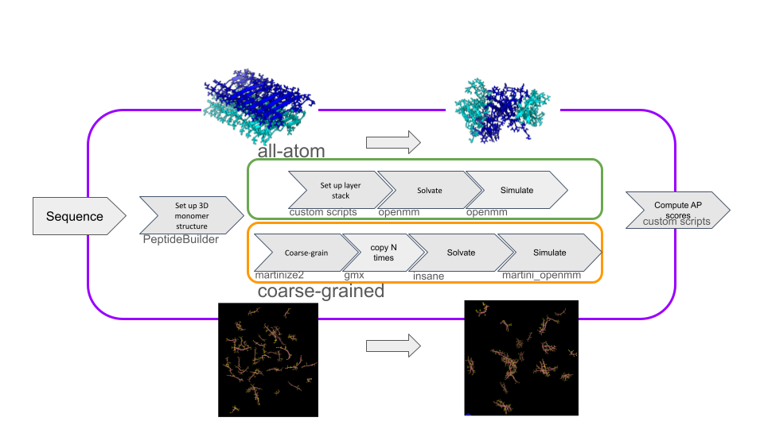

# aggrepep

## Introduction
This repo is a toolkit for designing and examining self-assembling peptides. The package provides scripts and methods for setting up coarse-grained martini 2.3 polarizable water peptide aggregation simulations, all-atom assembly 'destabilization' simulations, and the analysis of these simulations. Self-assembling peptides are those peptides which will aggregate into (usually) nanofibers, which can then be used in various biomaterial and therapeutic applications.

In this project's methodology, we examine whether a given peptide sequence is prone to self-assemble through simulations. We offer two modes: all-atom disassembly, and coarse-grained assembly, simulations. In the first, a stack of 20 peptide chains are set up into two stacked 10mer sheets that maximize hydrophobic residues pointing inwards, and amount of beta-strand content as measured using MDTraj's dssp. In the second, CG assembly mode, a martini2.3 polarizable water simulation is setup and run. After a simulation is completed, analysis metrics are computed. 

## Project Structure

- `aggrepep/` - package source directory
- `scripts/`  - scripts necessary for setting up conformations
- - sequence_to_structure.py in all-atom mode, this script sets up either a two-layer stack of peptides.
- `bash_scripts/` - utility bash scripts for running the pipeline, and performing CG setup.
- `README.md` - project overview and usage guide

## Installation
At the moment, there is no pypi method of installing this package. So you will have to clone this repo, make a python virtual environment, and install it manually. 
```bash
pip install -e .
```

## Usage
Some usage of this package is command-line specific, and some of it is python specific. 

### Command-line usage
To run the pipeline with a desired sequence (with an arbitrary ID):
```bash
bash bash_scripts/run_pipeline.sh "INPUT_SEQUENCE" "INPUT_SEQUENCE_ID" "USE_AA"
```
where USE_AA='y' or 'n', for an all-atom or a coarse-grained simulation.

To instead run the pipeline on a batch of sequences (at the moment pairs of sequences in parallel on separate GPUs)
```bash
bash bash_scripts/run_pipeline_batch.sh 
```
Inside of the file you must specify USE_AA and also the sequences you want to simulate. 

### Pure python usage
Some of the functions in the package can be imported from Python

<!-- ```python
import aggrepep

# Example usage
# result = aggrepep.analyze(peptide_sequence)
``` -->

## Development

- Clone the repository
- Create a virtual environment
- Install dependencies
- Run tests if available

## Contributing

Contributions are welcome. Please open issues for improvements or suggestions.

