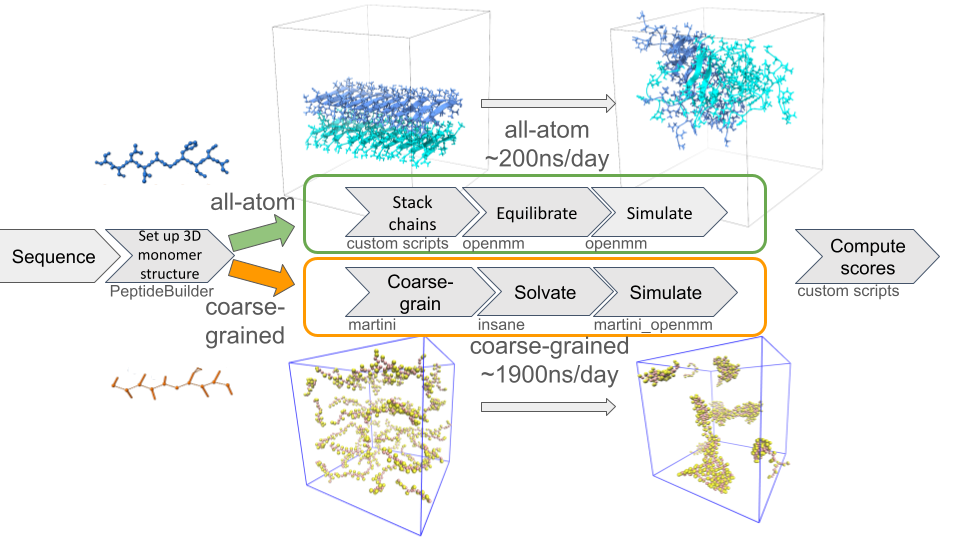

# aggrepep

## Introduction
Self-assembling peptides are those peptides which will aggregate into (usually) nanofibers, which can then be used in various biomaterial and therapeutic applications. 

This repo is a toolkit for designing and examining self-assembling peptides. The package provides scripts and methods for setting up coarse-grained martini 2.3 polarizable water peptide aggregation simulations, all-atom assembly 'destabilization' simulations, and the analysis of these simulations.

For all-atom assembly 'destabilization simulations', a stack of 20 peptide chains are set up into two stacked 10mer sheets that maximize hydrophobic residues pointing inwards, and amount of beta-strand content as measured using MDTraj's dssp. In the second, aggregation simulations, a martini2.3 polarizable water simulation is setup and run. After a simulation is completed, analysis metrics are computed. 

Automated analysis depends on the chosen pathway:
- Coarse-grained
    - Kinetics of aggregation, fitting modified, finite-number of particles, Smoluchowski equations to the aggregation behaviour. Also fitting solutions of unmodified, infinite number of particles Smoluchowski equation.
    - Fractal geometry estimation via correlation dimension
    - Simple shape descriptors
    - SASA aggregation propensity score 
- All-atom
    - Beta-strand content
    - SASA aggregation propensity score
    - Contact-based aggregation propensity score 

## Project Structure

- `aggrepep/` - package source directory
- `scripts/`  - scripts necessary for setting up conformations
- - sequence_to_structure.py in all-atom mode, this script sets up either a two-layer stack of peptides.
- `bash_scripts/` - utility bash scripts for running the pipeline, and performing CG setup.
- `README.md` - project overview and usage guide

## Installation
At the moment, there is no pypi method of installing this package. So you will have to clone this repo, make a python virtual environment, and install it manually.
### Dependencies
This project has a number of dependencies, some of which are captured in the setup.py and requirements.txt. But a version of gromacs is required for gmx insert-molecules. In the future, this will hopefully be updated such that we no longer require gromacs. [vermouth](https://github.com/marrink-lab/vermouth-martinize) is used for martinize2. [insane](https://github.com/Tsjerk/Insane) is used for solvation. [openmm](https://github.com/openmm/openmm) and [martini_openmm](https://github.com/maccallumlab/martini_openmm) are used for simulating all-atom and coarse-grained systems, respectively.

### Virtual environment
First make a virtual environment. I recommend using uv for that purpose. 
```
uv venv my-env-name
```

### Activate the environment
Once the environment is created, you may have to activate it. There are two ways of doing so:
```
uv my-env-name
```
or 
```
source my-env-name/bin/activate
```

### Grab additional dependencies
martini_openmm and PDBFixer are not available on pypi. One option is to make a directory called 'additional-repos', and git clone martini_openmm and PDBFixer into that directory. Then pip install them:
```
uv pip install additional-repos/martini_openmm/
uv pip install additional-repos/PDBFixer/
```

### install the aggrepep package
```bash
pip install -e .
```

## Usage on Digital Alliance of Canada 
A boiler-plate slurm submission script is included, named submit_batch_job-minimal.sh 

## Usage
Some usage of this package is command-line specific, and some of it is python specific. 

> [!NOTE]
> In coarse_grained_pw_setup.sh you must edit VENV_DIR to point to your virtual environment. 

### Pure python usage
It is recommended to run the code using the python scripts in the `scripts` directory. To test
the installation and environment, run `python scripts/driver_import_only.py`. All this does is import
all packages needed for the simulation workflow. If it breaks, it should lead you to a
missing dependency.

For default usage and to test that the code can run basic simulations, 

`python scripts/driver_batch_sequences.py --input_file data/input_files/simpleseq.csv --wdir data/outputs/simpleseq --smoke_test --n_jobs 1 --params_file params.json` 

<!-- ```python
import aggrepep

# Example usage
# result = aggrepep.analyze(peptide_sequence)
``` -->

### Command-line usage
To run the pipeline with a desired sequence (with an arbitrary ID):
```bash
bash bash_scripts/run_pipeline.sh "INPUT_SEQUENCE" "INPUT_SEQUENCE_ID" "USE_AA"
```
where USE_AA='y' or 'n', for an all-atom or a coarse-grained simulation.

To instead run the pipeline on a batch of sequences (at the moment pairs of sequences in parallel on separate GPUs)
```bash
bash bash_scripts/run_pipeline_batch.sh 
```
Inside of the file you must specify USE_AA and also the sequences you want to simulate. 


## Contributing

Contributions are welcome. Please open issues for improvements or suggestions. Alternatively, feel free to email or message me. 

